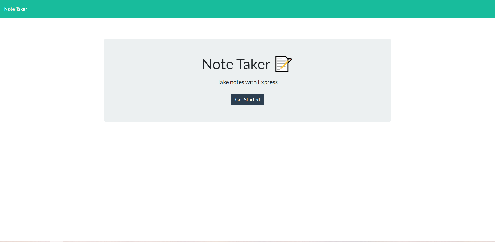
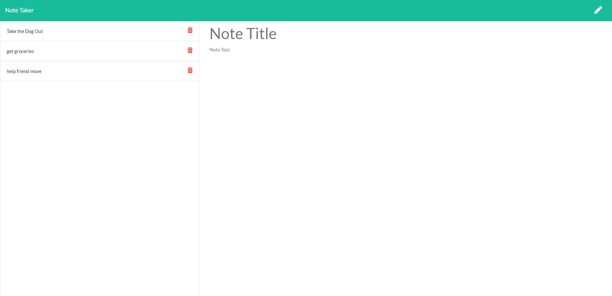

# note_taker

## Description

This is a simple note taker app that saves your notes in a JSON file and allows you to delete and add different notes. This application is deployed on Heroku with a link to the deployment below.

## Usage

[Link to my webpage hosted on Heroku](https://shrouded-harbor-35026.herokuapp.com/)

## License

[MTI License](./LICENSE)